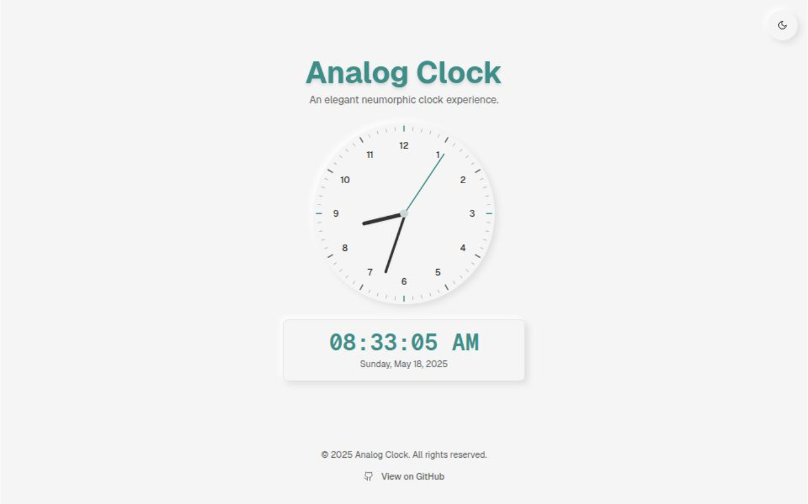
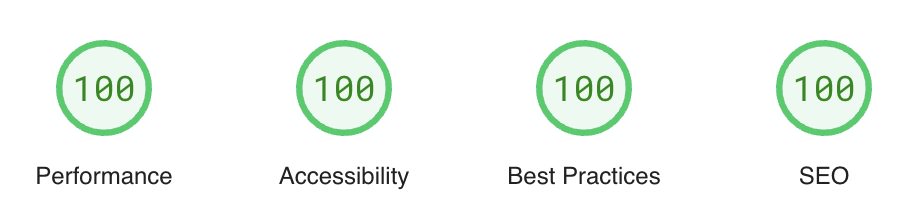

# Analog Clock - Neumorphic Timepiece 🕰️✨

[](https://analog-clock.noteapp.icu) <!-- Replace with your preview image and live URL -->

<p align="center">
  
  
  
  
  
  
</p>

An elegant and interactive neumorphic analog clock. Experience time with a clean, modern design, featuring both analog and digital displays, light/dark themes, and localization support.

## 🌟 Key Features

*   🎨 **Neumorphic Design**: Smooth modern UI with neumorphic shadows and highlights.
*   ⏱️ **Analog Clock**: Classic analog clock face with hour, minute, and second hands, including hour numerals and a second-hand tail.
*   💻 **Digital Clock**: Clear digital display for the current time (HH:MM:SS) and date, formatted according to the user's locale.
*   🌗 **Theme Toggle**: Seamlessly switch between light and dark themes. Theme preference is saved in `localStorage`.
*   🌍 **Localization**:
    *   Automatic detection of the user's browser language.
    *   Currently supports English (en), Spanish (es), and Indonesian (id).
    *   Date and time formats adapt to the selected locale.
    *   Locale preference is saved in `localStorage`.
*   📱 **Responsive Design**: Adapts to various screen sizes, from mobile to desktop, aiming for a single canvas display.
*   🔍 **SEO Friendly**: Includes relevant meta tags for better search engine visibility.
*   🛠️ **Built with Modern Technologies**: Leverages Next.js (App Router), React, Tailwind CSS, and ShadCN UI components.

## ✅ Lighthouse score

[](https://pagespeed.web.dev/analysis/https-clock-noteapp-icu/i1fe26154e?form_factor=desktop&hl=en)

## 🚀 Tech Stack

*   **Framework**: 
*   **UI Library**: 
*   **Styling**: 
*   **UI Components**: 
*   **State Management**: React Context API
*   **Icons**: 
*   **Language**: 

## 🏁 Getting Started

Follow these instructions to get a copy of the project up and running on your local machine for development and testing purposes.

### 📋 Prerequisites

*   Node.js (v18.18.0 or later recommended, see `package.json` for `engines`)
*   npm (v9.x or later recommended) or yarn

### 🛠️ Installation

1.  **Clone the repository:**
    ```bash
    git clone https://github.com/relvinarsenio/analog-clock.git
    cd analog-clock
    ```

2.  **Install dependencies:**
    Using npm:
    ```bash
    npm install
    ```
    Or using yarn:
    ```bash
    yarn install
    ```

### ▶️ Running the Development Server

To start the development server:

Using npm:
```bash
npm run dev
```
Or using yarn:
```bash
yarn dev
```
Open [http://localhost:9002](http://localhost:9002) (or the port specified in your `package.json`) in your browser to see the application.

The page will automatically reload if you make changes.

## 📜 Available Scripts

In the project directory, you can run:

*   `npm run dev` or `yarn dev`:
    Runs the app in development mode.

*   `npm run build` or `yarn build`:
    Builds the app for production to the `.next` folder.

*   `npm run start` or `yarn start`:
    Starts a production server after a build.

*   `npm run lint` or `yarn lint`:
    Runs ESLint to analyze the code for potential errors and style issues.

*   `npm run typecheck` or `yarn typecheck`:
    Runs the TypeScript compiler to check for type errors.

## ☁️ Deployment

This Next.js application can be deployed to any hosting platform that supports Node.js or Next.js applications.

*   **[Vercel](https://vercel.com/)**: Recommended for Next.js applications. Deployment is usually seamless.
*   **[Netlify](https://www.netlify.com/)**: Also offers good support for Next.js.
*   AWS Amplify
*   Google Cloud Run
*   DigitalOcean App Platform

For production Lighthouse scores, always test a production build.

## 🤝 Contributing

Contributions are what make the open-source community such an amazing place to learn, inspire, and create. Any contributions you make are **greatly appreciated**.

If you have a suggestion that would make this better, please fork the repo and create a pull request. You can also simply open an issue with the tag "enhancement".
Don't forget to give the project a star! Thanks again!

1.  Fork the Project
2.  Create your Feature Branch (`git checkout -b feature/AmazingFeature`)
3.  Commit your Changes (`git commit -m 'Add some AmazingFeature'`)
4.  Push to the Branch (`git push origin feature/AmazingFeature`)
5.  Open a Pull Request

## 📄 License

This project is open source and licensed under the MIT License. See the `LICENSE` file for details (you might need to add it if it's not already present).

<p align="center">
  <a href="https://github.com/relvinarsenio/analog-clock/blob/main/LICENSE">
    
  </a>
</p>

## 🙏 Acknowledgements

*   [ShadCN UI](https://ui.shadcn.com/) for the amazing UI components.
*   [Lucide React](https://lucide.dev/) for its icon set.
*   [Next.js Team](https://nextjs.org/) and [React Team](https://reactjs.org/).


